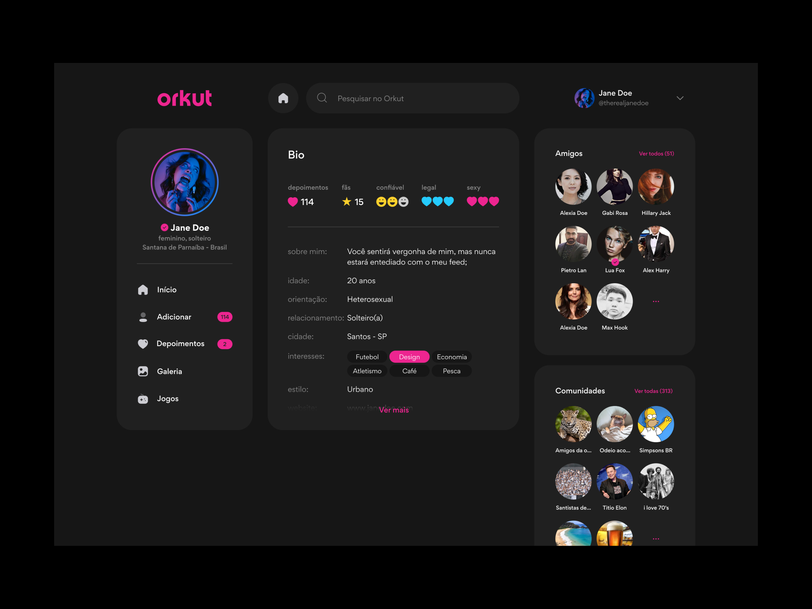
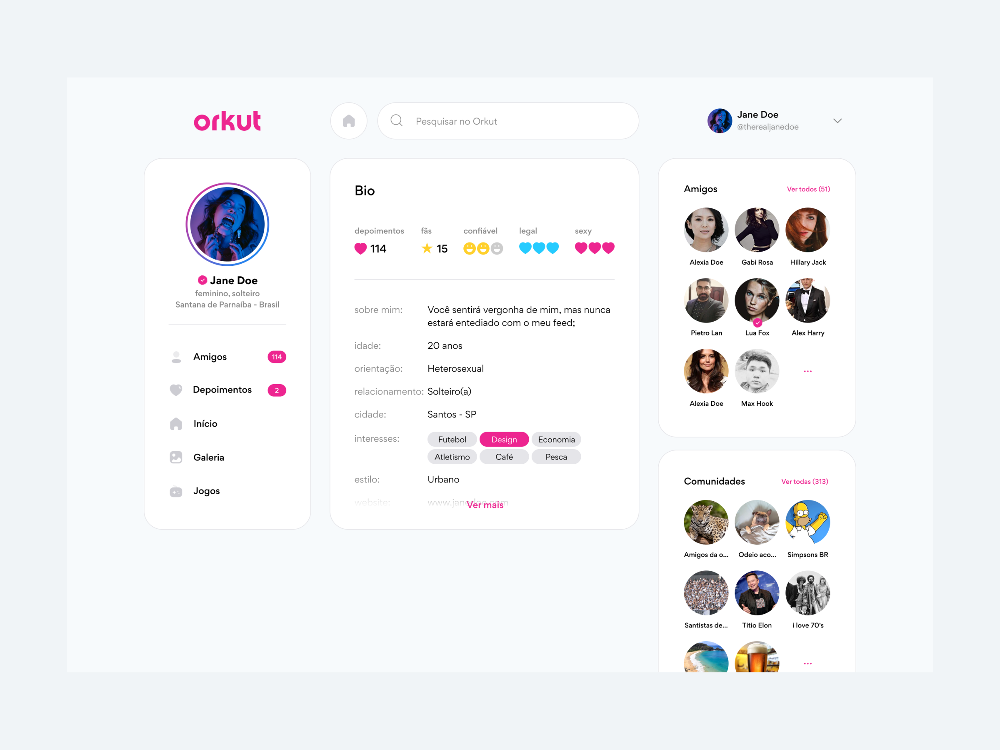

## About

Implementation of the redesign of the social network [Orkut](http://www.orkut.com/index.html) based on the prototype of [Blainer Costa](https://dribbble.com/shots/18214410-Orkut-redesign)

[](dark-mode.png)
[](light-mode.png)

## Getting Started

##### Step 1: Clone the project

```bash
  git clone https://github.com/miguelbuca/Orkut.git
```
##### Step 2: Open the project

```bash
  cd Orkut
```

##### Step 3: Install dependencies

```bash
  yarn install
```
#### Run project

```bash
npm run dev
# or
yarn dev
```

Open [http://localhost:3000](http://localhost:3000) with your browser to see the result.